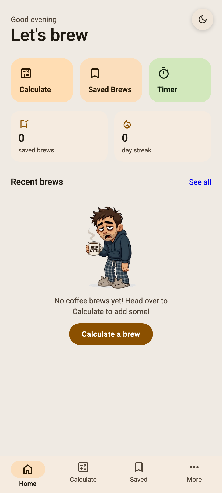
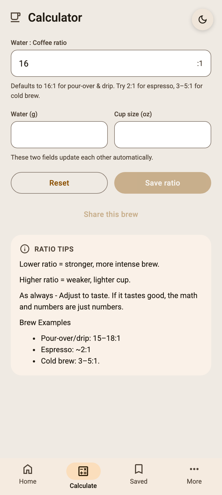
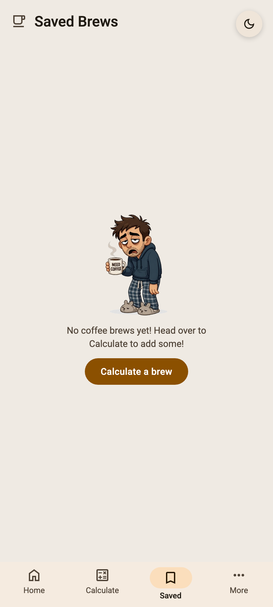
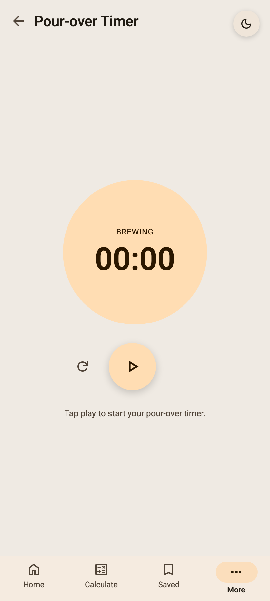
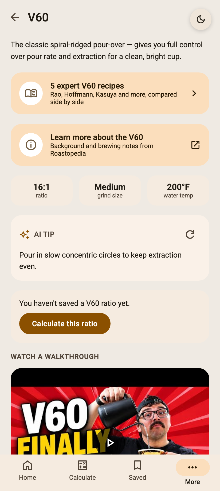
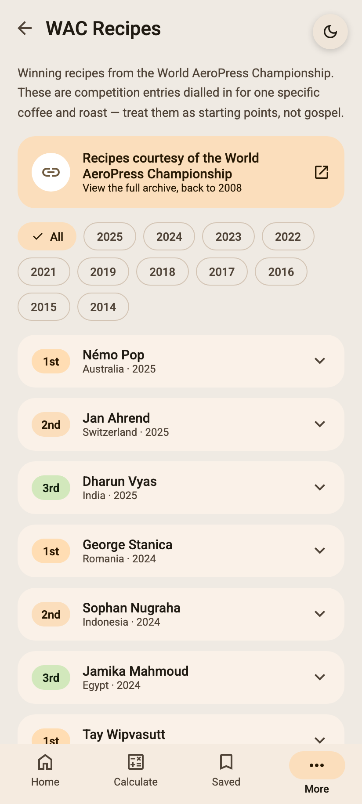
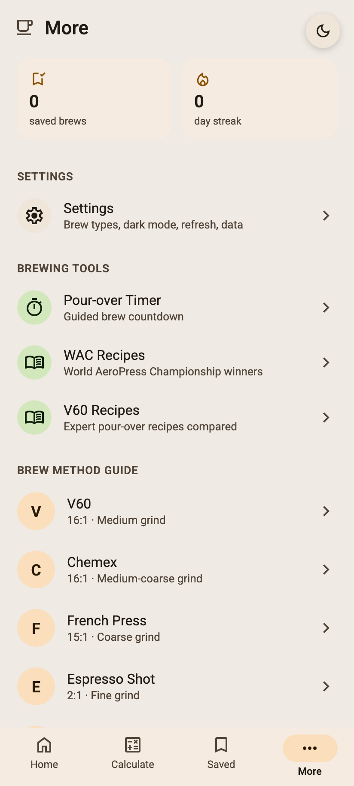
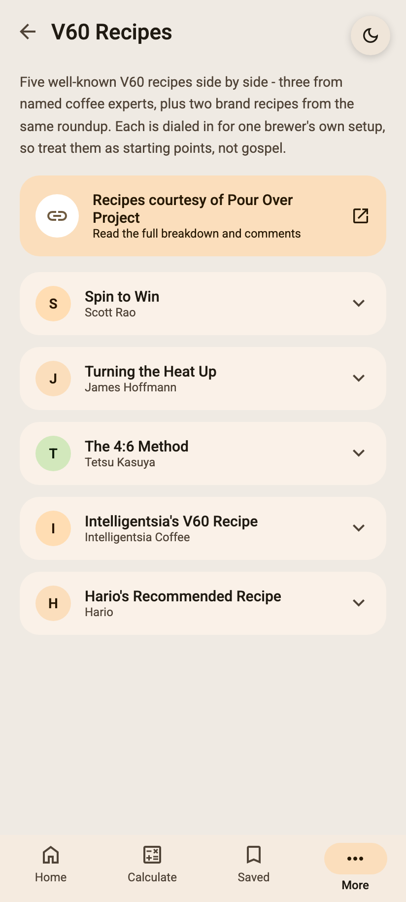
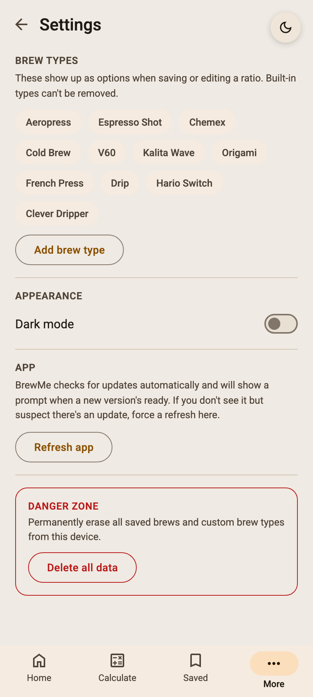

# BrewMe ☕

A ground-up rewrite and complete redesign of the **BrewMe** coffee brew calculator, timer, and brewing guide app. Built with **Lit Element (Lit 3)**, **TypeScript**, and **Vite** as a modern, high-performance Progressive Web App (PWA).

---

## 🚀 About BrewMe & History

BrewMe was born as a simple tool for coffee lovers to calculate water-to-coffee ratios, time pour-overs, explore brew guides, and track saved recipes.

The project evolved across three iterations:

1. **V1 (Ionic)**: initially created as a hybrid mobile app built with Ionic.
2. **V2 (Next.js)**: shifted to a React and Next.js web app for desktop and mobile browsers.
3. **V3 (Lit Element)**: rewritten from scratch using **Lit 3** and standard Web Components. Moving to Lit eliminated extra tooling overhead, shrank bundle size, and cut load times.

---

## 📸 Screenshots

| Home | Brew Calculator | Saved Brews |
| :---: | :---: | :---: |
|  |  |  |

| Pour-over Timer | Brew Guide | WAC Recipes |
| :---: | :---: | :---: |
|  |  |  |

| More Options | V60 Recipes | Settings |
| :---: | :---: | :---: |
|  |  |  |

---

## ✨ Features

- ⚖️ **Water:Coffee Brew Calculator**: live coffee grounds and water volume calculations.
- 💾 **Saved Brews & Streak Tracking**: store custom ratios in IndexedDB with category filters and automatic daily brewing streak calculations.
- ⏱️ **Pour-Over Timer**: timer for step-by-step pour-over brewing.
- 📖 **Curated Brew Method Guides**: walkthroughs and lazy-loaded YouTube videos for V60, AeroPress, Chemex, French Press, Kalita Wave, Clever Dripper, and Espresso.
- 🏆 **World AeroPress Championship (WAC) Recipes**: podium recipes from 2014 to 2025, filterable by year with creator attribution.
- 📱 **Offline-First PWA**: app shell precached with Workbox, custom install dialogs, non-intrusive update notifications, and offline support.
- 🎨 **Adaptive Design & Theming**: automatic light and dark theme detection with instant runtime toggling. The layout shifts from a mobile bottom tab bar to a desktop left navigation rail.

---

## 🛠️ Tech Stack & Tooling

BrewMe uses a small, modern frontend toolchain:

| Tool | Purpose |
| --- | --- |
| **[Lit 3](https://lit.dev/)** | Core Web Components library using standard browser Shadow DOM. |
| **[TypeScript](https://www.typescriptlang.org/)** | Type safety across the codebase (strict mode enabled). |
| **[Vite](https://vitejs.dev/)** | Fast development server and production build bundler. |
| **[@lit-labs/preact-signals](https://github.com/lit/lit/tree/main/packages/labs/preact-signals)** | Reactive, fine-grained state management signal stores. |
| **[idb](https://github.com/jakearchibald/idb)** | Promise-based wrapper around IndexedDB for offline data persistence. |
| **[@lit-labs/router](https://github.com/lit/lit/tree/main/packages/labs/router)** | Client-side routing with lazy-loaded view modules. |
| **[vite-plugin-pwa](https://vite-pwa-org.netlify.app/)** | Service worker generation and Workbox precaching for PWA support. |
| **[Playwright](https://playwright.dev/)** | Automated screenshot generation for documentation & CI/CD. |
| **[Oxlint](https://github.com/oxc-project/oxc)** & **[Oxfmt](https://github.com/oxc-project/oxc)** | High-speed JavaScript and TypeScript linting and formatting. |
| **[Vitest](https://vitest.dev/)** | Fast unit test runner with V8 code coverage. |

---

## 🏁 Getting Started

### Prerequisites

- **Node.js**: `v18.0.0` or higher
- **npm**: `v9.0.0` or higher

### Installation

Clone the repository and install dependencies:

```bash
git clone https://github.com/your-username/brew-me-app-lit.git
cd brew-me-app-lit
npm install
```

### Running Locally

Start the Vite development server:

```bash
npm run dev
```

Open your browser to `http://localhost:5173`.

### Production Build & Preview

To typecheck and compile the application for production:

```bash
npm run build
```

To preview the built production app locally:

```bash
npm run preview
```

### Testing & Code Quality

Run unit tests with coverage:
```bash
npm test
```

Run linting checks:
```bash
npm run lint
```

Format the codebase:
```bash
npm run fmt
```

### Updating Screenshots

Generate fresh app screenshots automatically using Playwright:
```bash
npm run screenshots
```

---

## 📚 Project Architecture & Contributing

- **Architectural Rationale & AI Context**: deep technical background and design specs live in [`docs/AI_CONTEXT.md`](./docs/AI_CONTEXT.md).
- **Contributing Guidelines**: check [`.github/CONTRIBUTING.md`](./.github/CONTRIBUTING.md) for coding conventions and pull request steps.
- **License**: BrewMe is open-source software released under the [MIT License](./.github/LICENCE.md).
